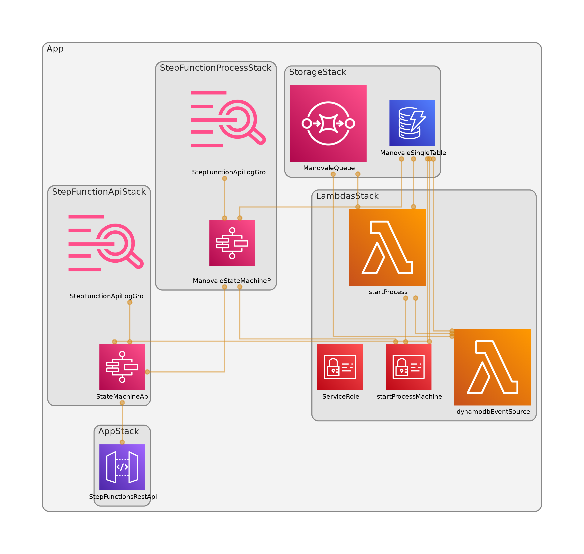

# Manovale

**STATUS** WIP

AWS Serverless job manager with API Gateway, DynamoDB, Lambda and Step Functions



## DynamoDB Single Table

```text
pk, sk
jobs:delayed, ID
QUEUE, ID
jobs:count:STATUS, QUEUE
jobs:lambdas, QUEUE
```

## Useful commands

* `npm run build`   compile typescript to js
* `npm run watch`   watch for changes and compile
* `npm run test`    perform the jest unit tests
* `cdk deploy`      deploy this stack to your default AWS account/region
* `cdk diff`        compare deployed stack with current state
* `cdk synth`       emits the synthesized CloudFormation template

## Notes

* dynamodb ttl could fire your lambda for delayed jobs in any moment after the expire, probably after minutes
